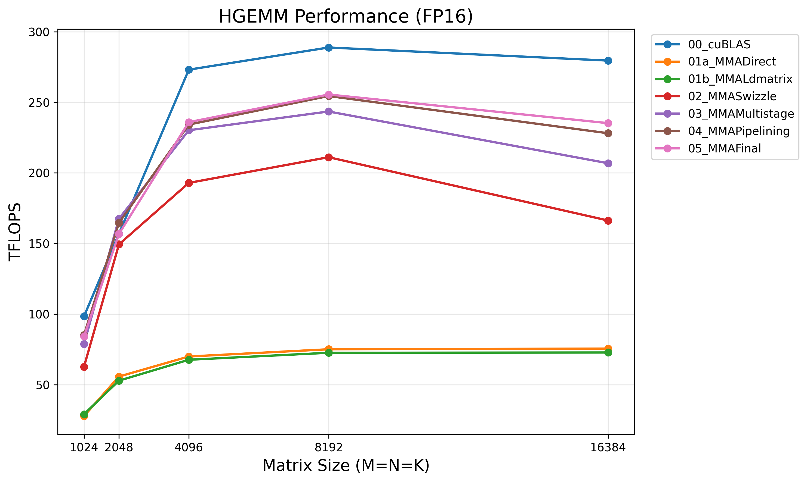

# PTX MMA HGEMM Optimization

A step-by-step exploration of FP16 GEMM optimization using NVIDIA Tensor Cores and inline PTX `mma.sync.aligned.m16n8k16`.

Companion project to [cuda-hgemm-wmma](https://github.com/yencal/cuda-hgemm-wmma), which uses the higher-level WMMA API. This project drops down to raw PTX for finer control over fragment layout, shared memory access patterns, and instruction scheduling.

## Requirements

- CUDA Toolkit (tested with 12.x)
- GPU with SM 80+ (Ampere or later)
- Python 3 + matplotlib (for plotting)

## Build & Run

```bash
make ARCH=sm_80
./hgemm_bench
python3 scripts/plot_results.py hgemm_results.csv
```

For NCU profiling of individual kernels:

```bash
make profile
./profile 5
```

## Kernel Progression

| Kernel | Description |
|--------|-------------|
| cuBLAS | cuBLAS reference (FP16 tensor cores) |
| 01a_MMADirect | PTX MMA baseline with element-by-element smem loads |
| 01b_MMALdmatrix | + `ldmatrix.sync.aligned` for warp-cooperative fragment loads |
| 02_MMASwizzle | + XOR swizzle on shared memory for bank conflict elimination |
| 03_MMAMultistage | + Multi-stage async pipeline (cp.async, overlapped tile loads) |
| 04_MMAPipelining | + Fragment double buffering, interleaved async copy at k-loop midpoint |
| 05_MMAFinal | + Block swizzle for L2 cache locality, autotuning |
## Results

**NVIDIA A100-SXM4 (40 GB)**

The final kernel achieves **88% of cuBLAS** performance (256 vs 289 TFLOPS at N=8192).



| Kernel | N=4096 | N=8192 | N=16384 | % cuBLAS (N=8192) |
|--------|--------|--------|---------|-------------------|
| cuBLAS | 274 | 289 | 285 | 100% |
| 01a_MMADirect | 70 | 75 | 76 | 26% |
| 01b_MMALdmatrix | 68 | 73 | 73 | 25% |
| 02_MMASwizzle | 193 | 212 | 166 | 73% |
| 03_MMAMultistage | 231 | 245 | 214 | 85% |
| 04_MMAPipelining | 235 | 255 | 237 | 88% |
| 05_MMAFinal | 236 | 256 | 242 | 88% |

## Blog Post

For a detailed walkthrough of the optimization techniques, see the accompanying blog post:
[Tensor Core HGEMM: Dropping to PTX mma.sync](https://yencal.github.io/gpu-hgemm-mma/)
